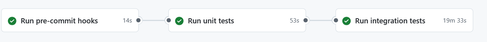
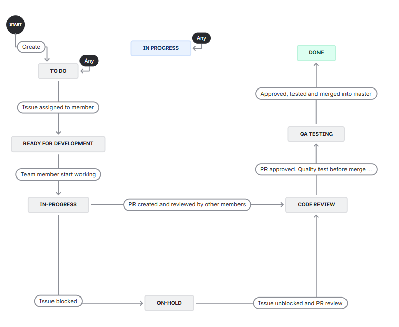
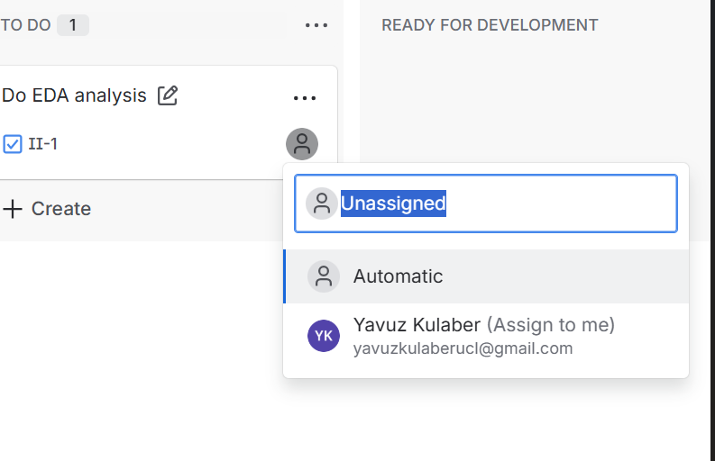
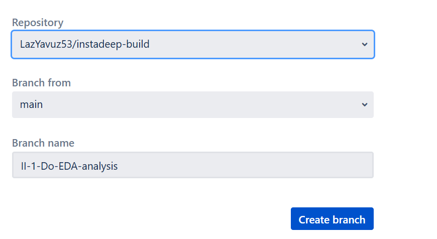
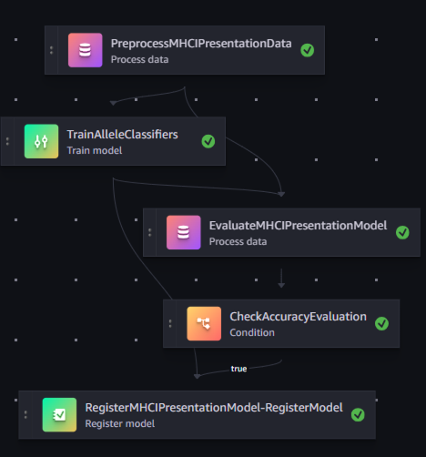
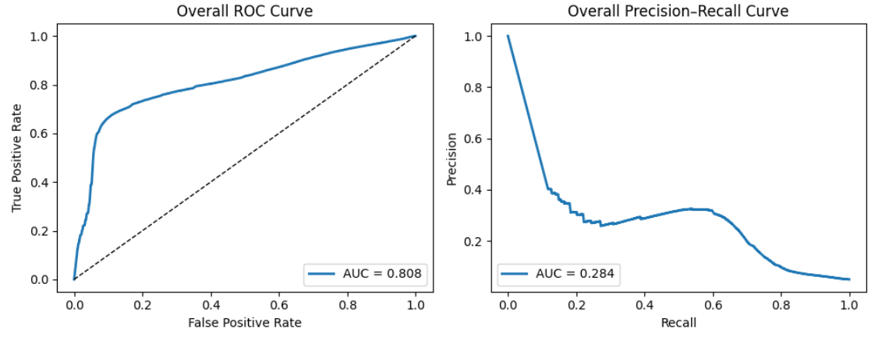
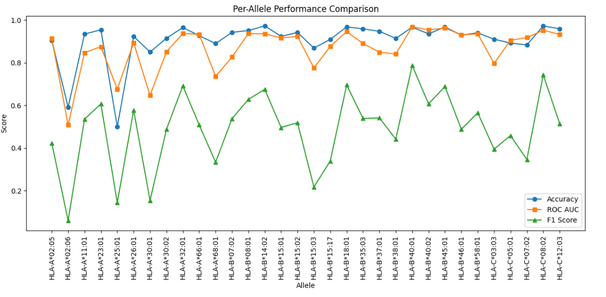

## Layout of the Project Repository


```
├── codebuild-buildspec.yml      # Definition used by AWS CodeBuild to run CI jobs
├── CONTRIBUTING.md              # Contribution guidelines for collaborators
├── data_analysis/               # Utilities and cleaning scripts for exploratory analysis
├── developer.md                 # Developer-focused setup and workflow notes
├── img/                         # Images referenced in documentation and presentations
├── pipelines/                   # Pipeline package and entry points
│   ├── InstaDeepMHCIPresentation/
│   │   ├── evaluate.py          # Model evaluation step definition
│   │   ├── pipeline.py          # Orchestrates the full SageMaker pipeline
│   │   ├── preprocess.py        # Data preprocessing logic used by the pipeline
│   │   └── __init__.py
│   ├── __init__.py
│   ├── __version__.py
│   ├── _utils.py
│   ├── get_pipeline_definition.py
│   ├── run_pipeline.py
│   └── train.py
├── requirements.txt             # Python dependencies for local development and testing
├── sagemaker-pipelines-project.ipynb  # Notebook describing the SageMaker project setup
├── setup.cfg                    # Package metadata and configuration for tooling
├── setup.py                     # Package installation entry point
├── tests/
│   └── test_pipelines.py        # Unit tests for the pipeline package
├── tox.ini                      # Tox environments for running tests and linters
└── training_notebook/           # Assets for the interactive model training notebook
    ├── full_training.ipynb
    ├── clean/
    ├── models/
    └── outputs/
```

# MHCI Presentation Project

##  Getting Started
 
This guide will help you set up your environment and contribute effectively to the **MHCI Presentation** repository.  
Please follow the steps carefully to prepare your environment and align with our software and project management best practices.

---

## 🧩 Software Best Practices

Following CI/CD are implemented;

1- Lint Code (Checking th code quality)
2- Unit test
3- Integration test: Whenever a change maded to branch, AWS Sagemaker pipeline runs at back end. If pipeline succesfull, the PR is allowed to merge into master. Please see example in the picture;



### 1️⃣ Create a New Environment
```powershell
python -m venv myenv
```

### 2️⃣ Activate the Environment
```powershell
.\myenv\Scripts\Activate
pip install -r requirements.txt
```

### 3️⃣ Pre-Commit Setup
We use **pre-commit hooks** to automatically check code quality before each commit.  
The configuration is defined in `.pre-commit-config.yaml`.

#### Installation
```bash
pip install pre-commit
```

If `pre-commit` is not executable from your terminal, update your PATH:
```bash
echo "export PATH=\$PATH:~/.local/bin/" >> ~/.bashrc
source ~/.bashrc
which pre-commit
```

#### Setup Hooks
Run the following to activate the pre-commit hooks:
```bash
pre-commit install
```

The hooks will now run automatically on every commit.  
To test them manually, run:
```bash
pre-commit run --all-files
```

---

## 🗂 Project Management Best Practices

We use **Jira** as our Agile project management environment to track issues and progress.

### 📊 Project Workflow

| Status | Description |
|--------|--------------|
| 📝 **To Do** | Create a new ticket. |
| ⚙️ **Ready for Development** | Assign a team member to the ticket. |
| 🚧 **In Progress** | Assigned member starts development. |
| ⏸️ **On Hold** | Developer is blocked; project manager may reassign. |
| 🔍 **Code Review** | Developer submits a PR; reviewers request and verify changes. |
| 🧪 **QA Test** | Developer performs required tests post-review. |
| ✅ **Done** | All tests pass, and the PR is merged into `master`. |

---

Project cycle is shown in Figure



### 🔄 How to Contribute

1. **Create an Issue**  
   Log a new issue in Jira and assign it to the responsible person.

   

2. **Create a Branch**  
   - In Jira, open the ticket and click **“Create Branch.”**  
   - Select the repository and confirm.

   

3. **Start Development**
   ```bash
   git checkout <branch-name>
   ```
   Begin developing according to the project workflow above.

4. **Pull Request & Review**
   - The `master` branch is **protected** — direct pushes are **not allowed**.  
   - To merge, create a **Pull Request (PR)**.  
   - At least **two approvals** from team members are required before merging into `master`.

---

## 🧠 MHCI Presentation Project Project Overview

### 🎯 Goal
Develop and evaluate machine learning models for predicting **peptide–MHC class I binding affinity** using **allele-specific approaches**, and build a scalable ML pipeline with **AWS SageMaker**.

---

## ⚙️ How to Run

### 🧪 Running the Training Notebook
1. Add all datasets to:
   ```
   training_notebook/Datasets/
   ```
2. Navigate to the directory:
   ```bash
   cd training_notebook
   ```
3. Run the notebook **cell by cell**.  
   Debugging outputs are provided to visualize ongoing processes.

---

### ⚙️ Running Only Preprocessing

This section is same with the preprocessing in the notebook. This was for myself to decide how I go about the training. Not compulsory to run
1. Add datasets to:
   ```
   data_analysis/datasets/
   ```
2. Run:
   ```bash
   cd data_analysis
   python preprocessing.py
   ```

---

<details>
<summary><b>📊 Data Preprocessing & EDA (click to expand)</b></summary>

Before training machine learning models, understanding and cleaning the data is critical.  
The following steps were performed:

- Followed [HLA allele naming convention](https://hla.alleles.org/pages/nomenclature/naming_alleles/).  
- ✅ **Training set:** clean and consistent.  
- ⚠️ **Test set:** corrected allele naming errors. According to nomenclature, there were mistakes in allele naming  
- 🧹 **Duplicates:** removed.  
- 📉 **Missing values:** none (except some `QQQQQ`).  
- 🧬 **Invalid peptides:** removed those containing non-standard amino acids (e.g., “X”).  
- 🚫 **Unseen alleles:** removed alleles absent in the training set. -	There were some allele in test set that does not exist in train. Although I could train pan allelic training, I decided to remove those does not exist in train set so I can train a model per allele. There were not much  
- 📏 **Sequence length:** peptides were padded per allele group to match the **maximum sequence length** in that group.  
- 📏 **Very imbalanced data:** -	Data sets is very imbalanced. Needs to be considered while training
  - During evaluation, allele-specific sequence lengths are retrieved dynamically.

</details>

---

<details>
<summary><b>🧠 Model Training Strategy (click to expand)</b></summary>

### Per-Allele Modeling

Each HLA allele represents a distinct MHC molecule with unique peptide-binding properties.  
To capture these patterns accurately, a **separate ML model was trained per allele**.

#### Model Selection

- **SGDClassifier (Logistic Loss)** for alleles with both binder and non-binder classes.
  - ⚡ **Scalable & Efficient:** Supports incremental (chunked) training.  
  - ⚖️ **Handles Class Imbalance:** Uses class weights to balance minority classes.  
  - 🔒 **Regularized:** L2 penalty to prevent overfitting.  
  - 🔍 **Interpretable:** Linear model allows inspection of feature importance.

- **DummyClassifier** for alleles containing only one class (e.g., all binders).

This hybrid approach ensures computational efficiency, interpretability, and robustness across all alleles.

</details>

---

<details>
<summary><b>📈 Evaluation Metrics (click to expand)</b></summary>

Given the dataset’s **imbalance** (non-binders ≫ binders), the following metrics were used:

| Metric | Description |
|--------|--------------|
| **ROC-AUC** | Measures ability to distinguish between binders and non-binders across thresholds; unaffected by imbalance. |
| **F1-score** | Balances precision and recall; crucial when binder misclassification is costly. |
| **Accuracy** | Reported for interpretability but not relied upon due to imbalance bias. |

These metrics offer a balanced evaluation of overall model performance and minority-class sensitivity.

</details>

---

<details>
<summary><b>☁️ AWS SageMaker End-to-End Pipeline (click to expand)</b></summary>

An **end-to-end ML pipeline** was developed to automate the full workflow — from preprocessing to model registration.

### Pipeline Components

| Script | Description |
|--------|--------------|
| `pipeline.py` | Orchestrates the entire MLOps workflow (preprocessing → training → evaluation → registration). |
| `preprocess.py` | Loads and preprocesses data from S3. |
| `train.py` | Trains allele-specific models and saves them to S3. |
| `evaluate.py` | Evaluates models using the test set. |
| **Model Registration** | Registers models for deployment after manual approval. |

✅ The pipeline runs successfully end-to-end, ensuring **reproducibility**, **traceability**, and **automation**.



</details>

---

## 📊 Results

### 🧩 Overall Performance

| Metric | Value | Interpretation |
|--------|--------|----------------|
| **ROC AUC** | ~0.808 | The model separates binders vs. non-binders well overall, independent of threshold. |
| **Accuracy** | ~0.901 | High accuracy, but likely inflated due to class imbalance (many negatives). |
| **F1-score** | ~0.391 | Indicates limited positive class capture at the default 0.5 threshold. |

**Additional Observations:**
- **ROC Curve:** Smooth, well above the diagonal across most false positive rates (FPRs).  
- **Precision–Recall Curve:** Precision declines sharply as recall increases, consistent with an imbalanced test set.

**Interpretation:**  
The classifier ranks peptides reasonably well (strong ROC AUC), but the default 0.5 decision threshold under-recovers positives.  
For applications prioritizing binder discovery (i.e., higher recall), a **tuned threshold** or **ranking-based selection** is preferable.

---

### 🧬 Per-Allele Performance

| Observation | Insight |
|--------------|----------|
| **Accuracy & ROC AUC** | Consistently high across alleles (~0.85–0.97 range), showing robust allele transferability. |



| **F1-score Variability** | Ranges between ~0.2–0.7+, expected due to allele-specific class imbalance and sample size. |
| **PR Curves** | Alleles with lower F1 tend to show steeper PR drop-offs, indicating fewer positives or harder boundaries. |
| **Failures** | None observed; all models show acceptable generalization. |

**Interpretation:**  
Per-allele models — each trained with allele-specific maximum sequence lengths — generalize well. However, **thresholding should be allele-aware**, particularly when optimizing for recall or binder prioritization.  



The model demonstrates:  
- Strong ranking ability overall (**ROC AUC ≈ 0.81**)  
- Consistently high **per-allele AUC/accuracy**  
- Robust generalization across HLA alleles  

However, the **default 0.5 threshold** yields modest F1 (~0.39) and declining PR curves as recall increases — reflecting class imbalance.  
Optimizing thresholds or adopting **rank-based selection** will improve binder detection.  
Allele-specific calibration or rebalancing is also recommended to enhance positive-class capture without sacrificing ranking quality.

---

